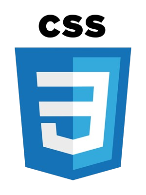
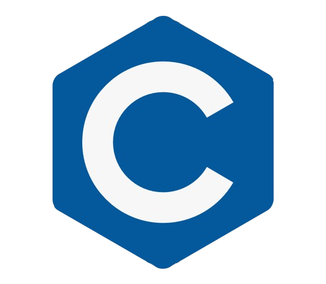

# Hello, I'm Manoel Teles! 👋

I am a Software Engineering student in my second semester at Universidade Católica de Brasília, constantly expanding my knowledge in web development and programming. My passion lies in building responsive, interactive web applications, and exploring new technologies. This profile is where I showcase my personal projects, experiments, and study materials.

## 🛠 Technologies & Tools I Use:

   
  
  

## 📊 GitHub Stats:

  
  

## 🚀 Current Focus:

As a student of Software Engineering, I'm focused on:
- Strengthening my foundation in programming.
- Continuously enhancing my problem-solving skills through coding challenges and projects.

## 📫 How to Reach Me:

  
  

